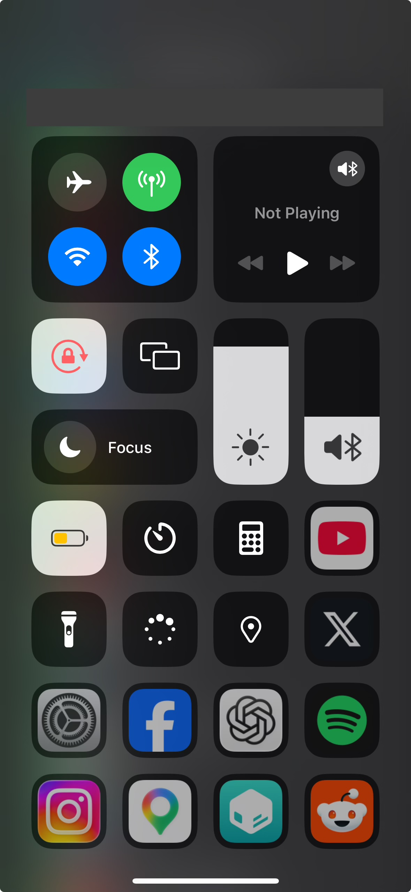

# CCApps

CCApps adds installed applications as individual Control Center modules. Tap a
module to open its app.



I made this because I got an iOS 17 jailbroken device and could not find a
Control Center app launcher that worked on my setup. iOS 17 tweak support is
still catching up, so this is something functional to use in the meantime.

This is not a polished or heavily tested release. It works on my device, but I
am not promising support, compatibility updates, new features, or ETAs. If it
is useful to you, use it. If it is not, do not install it. Issues and pull
requests are welcome, but they may not be addressed.

## What it does

- Discovers installed user and system applications automatically.
- Adds each launchable app to Settings > Control Center by name.
- Uses the installed app's full-color icon in Control Center.
- Requests Face ID or passcode before launching from a locked phone.
- Requests a SpringBoard restart after installation and removal in Sileo.

The app list is cached when the provider loads. Installing or deleting an app
may require closing Settings and respringing before the list updates.

## Compatibility

- iOS 17.0 through 17.3.1
- Dopamine/rootless jailbreak
- CCSupport 1.3.13 or newer
- Package architecture: `iphoneos-arm64` with arm64 and arm64e code

It has primarily been developed and tested on an iPhone 15 running iOS 17.
Other devices and configurations may behave differently.

## Install

Install `com.akuma.ccapps_1.0_iphoneos-arm64.deb` through Sileo, then use its
Restart SpringBoard action. Installed applications should appear individually
under Settings > Control Center > More Controls.

For a terminal installation on the phone:

```sh
sudo dpkg -i /path/to/com.akuma.ccapps_1.0_iphoneos-arm64.deb
sudo sbreload
```

## Build

CCApps requires Theos, an iOS SDK with the required private-framework stubs, and
an arm64e-capable Apple toolchain.

```sh
export THEOS=/path/to/theos
make clean package FINALPACKAGE=1
```

The rootless provider is installed at:

```text
/var/jb/Library/ControlCenter/CCSupport_Providers/CCAppsProvider.bundle
```

## License and credits

CCApps is available under the MIT License. It depends on
[CCSupport](https://github.com/opa334/CCSupport) by Lars Fröder. The local
`CCSModuleProvider` protocol declaration is derived from that MIT-licensed
project.
